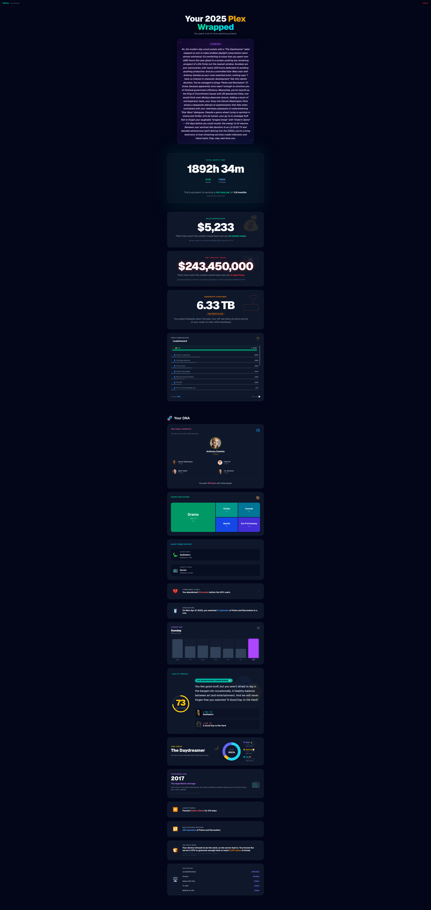

# RePlex

> [!CAUTION]
> **VIBE CODED PROJECT — HOST AT YOUR OWN RISK**  
> This project is 100% "vibe coded" (rapidly experimented/generated). It has **NOT** been audited for security.  
> **DO NOT HOST THIS ON THE PUBLIC INTERNET.**  
> It is intended strictly for internal/private network use. If you expose this to the web, you are effectively letting strangers into your house. You have been warned.

## Technical Overview
RePlex generates a "Spotify Wrapped" style year-in-review for Plex users by aggregating playback data from Tautulli.

### Stack
- **Framework**: [Next.js](https://nextjs.org/) (App Router, Server Actions)
- **Database**: SQLite (managed via [Prisma](https://www.prisma.io/))
- **Integration**: Tautulli API (User playback history)
- **AI**: OpenAI API (GPT-4o) for generating "roast" personality summaries.
- **Styling**: Tailwind CSS & Framer Motion.

### Core Features
- **Admin Dashboard**: (`/admin`) manage users, sync Tautulli history, and trigger report generation.
- **User Dashboard**: (`/dashboard?userId=X`) public-facing (internal) view for users to explore their stats.
- **AI Summaries**:  Generates a "brutally honest" personality roast based on watch history.
- **Caching**: Heavy Tautulli queries are cached in SQLite for instant dashboard loading.

## Broken? Fix it.
If something is broken, **fix it and create a Pull Request.**  
If you can't fix it, at least post an Issue with details. We appreciate contributions that keep the vibes going.

## Running with Docker

1. Ensure you have Docker and Docker Compose installed.
2. Copy `.env.example` to `.env`: `cp .env.example .env`
3. Run `docker compose up --build`.
4. The application will be available at `http://localhost:3000`.
5. The database is persisted in the `./prisma` directory.

### Setup (Local Dev)
1. Clone repo & `npm install`
2. Copy `.env.example` to `.env`: `cp .env.example .env`
3. `npx prisma db push`
4. `npm run dev`
5. Visit `/admin` to configure your Tautulli connection and generate admin credentials.

## Preview

## Future Roadmap / TODO

The project is functional but has plenty of room to grow. Here is what is on the radar:

- [ ] **Compare with other users (in the works)**: See how your stats stack up against the server average or specific friends.
- [ ] **Year Selection**: Currently defaults to the current year. Add ability to generate reports for previous years.
- [ ] **Background Jobs**: "Sync All Data" can be slow for large servers. Move this to a background queue (e.g., BullMQ) to avoid timeouts.
- [ ] **Public/Private Toggle**: Secure user dashboards with unique tokens or magic links instead of simple IDs to prevent enumeration.
- [ ] **Localization**: Support matching the dashboard language to the user's Plex/Tautulli language settings.
- [ ] **Testing**: Add unit and integration tests to ensure stability during refactors.
